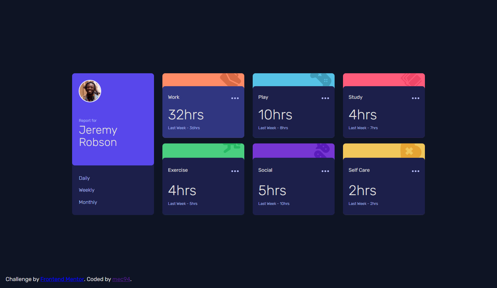

# Frontend Mentor - Time tracking dashboard solution

This is a solution to the [Time tracking dashboard challenge on Frontend Mentor](https://www.frontendmentor.io/challenges/time-tracking-dashboard-UIQ7167Jw). Frontend Mentor challenges help you improve your coding skills by building realistic projects. 

## Table of contents

- [Overview](#overview)
  - [The challenge](#the-challenge)
  - [Screenshot](#screenshot)
  - [Links](#links)
- [My process](#my-process)
  - [Built with](#built-with)
  - [What I learned](#what-i-learned)
  - [Continued development](#continued-development)
- [Author](#author)
- [Acknowledgments](#acknowledgments)

## Overview

### The challenge

Users should be able to:

- View the optimal layout for the site depending on their device's screen size
- See hover states for all interactive elements on the page
- Switch between viewing Daily, Weekly, and Monthly stats

### Screenshot

### Links

- Solution URL: [Add solution URL here](https://your-solution-url.com)
- Live Site URL: [Add live site URL here](https://your-live-site-url.com)

## My process

### Built with

- Vanilla JS
- Semantic HTML5 markup
- CSS custom properties
- Flexbox
- CSS Grid
- Mobile-first workflow

### What I learned

I learned a little more about grid properties

### Continued development

I plan to start learning a popular Javascript framework like React and get used with it

## Author

- Website - [Activate For Free](https://activateforfree.com) - Activate your Windows / Office 100% free without downloading anything external. It's a small personal project that i've been working on last year for anyone who needs.
- Frontend Mentor Profile - [@mec94](https://www.frontendmentor.io/profile/mec94)

## Acknowledgments

I revised Robert Rynard's solution to get some insights on how to tackle this challenge

[Robert Rynard's FM Profile](https://www.frontendmentor.io/profile/Robert-Rynard)

**Note: Delete this note and edit this section's content as necessary. If you completed this challenge by yourself, feel free to delete this section entirely.**
